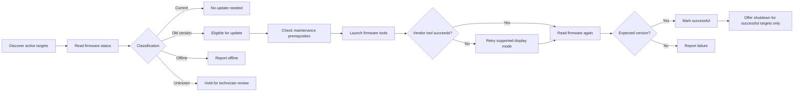

# 5916 Firmware Flash Utility

[← Back to Profile](../README.md) • [Work Projects](../WORK_PROJECTS.md)

> **Status:** Production-oriented firmware maintenance workflow  
> **Type:** Remote Windows hardware maintenance  
> **Focus:** Scan before write, verify after write

A remote firmware-maintenance utility for scanning, validating, updating, and verifying display firmware across multiple POS systems from one technician-facing interface.

## The Problem

Firmware maintenance across a fleet of checkout systems is normally repetitive and risky. A technician has to determine which systems are online, identify current versus outdated firmware, prepare the environment correctly, launch vendor utilities in the right display mode, verify the result, and then decide which systems are safe to shut down.

## The Solution

The 5916 Firmware Flash Utility turns that process into a guided workflow. It begins with a fleet-wide status scan, clearly separates current, outdated, offline, and unknown devices, and only proceeds with firmware writes on appropriate targets.

## Maintenance Workflow

## Core Capabilities

- Automatic discovery of active POS targets
- Multi-select lane workflow
- Pre-update firmware status scan
- Clear CURRENT / UPDATE AVAILABLE / OFFLINE / UNKNOWN classifications
- Firmware checksum-based version identification
- Maintenance-state awareness before firmware operations
- Interactive firmware-tool launching
- Display-mode retry handling when required by vendor tooling
- Post-update firmware verification
- Shutdown prompt limited to successfully updated systems
- Plain-language technician status messages
- Per-target fault isolation

## Pre-Scan Model

The status scan is intentionally independent from the write workflow. Every discovered target is classified first so the operator can see the environment before choosing what to change.

That distinction protects against a common maintenance failure mode: attempting an update simply because a device responded, without first proving that its existing firmware is a supported known version.

## Display-Mode Handling

Some vendor maintenance tools depend on the Windows display configuration. Rather than forcing a display change globally, the utility retries a supported alternate mode only when the initial launch fails in the normal mode.

This keeps the workaround targeted to the systems that actually need it.

## Engineering Focus

The difficult part of this project was coordinating several independent states at once:

- remote reachability,
- firmware version,
- application-protection state,
- logged-on interactive sessions,
- Windows display configuration,
- external vendor-tool behavior,
- and post-write firmware verification.

The utility treats each target independently so one failed lane does not make successful lanes ambiguous.

## Reliability & Guardrails

- **Scan before write**
- Do not treat unknown firmware as automatically safe to flash
- Verify required maintenance conditions before launching update tools
- Retry the alternate display mode only after the normal workflow fails
- Confirm firmware after the write instead of trusting process exit alone
- Keep success/failure state separate for every target
- Offer shutdown only for lanes that completed and verified successfully
- Keep low-level vendor output behind technician-friendly status wording

## What This Demonstrates

Remote Windows administration, hardware/firmware integration, process orchestration, state-machine design, verification-first automation, fault isolation, external-tool integration, and technician-focused UX.

## Technology

`Python` • `Windows GUI` • `Remote Administration` • `Firmware Integration` • `Process Control` • `Hardware State Detection`

> Public documentation intentionally omits firmware payloads, credentials, internal host discovery details, vendor command syntax, protection passwords, and environment-specific paths.

[← Back to Work Projects](../WORK_PROJECTS.md)