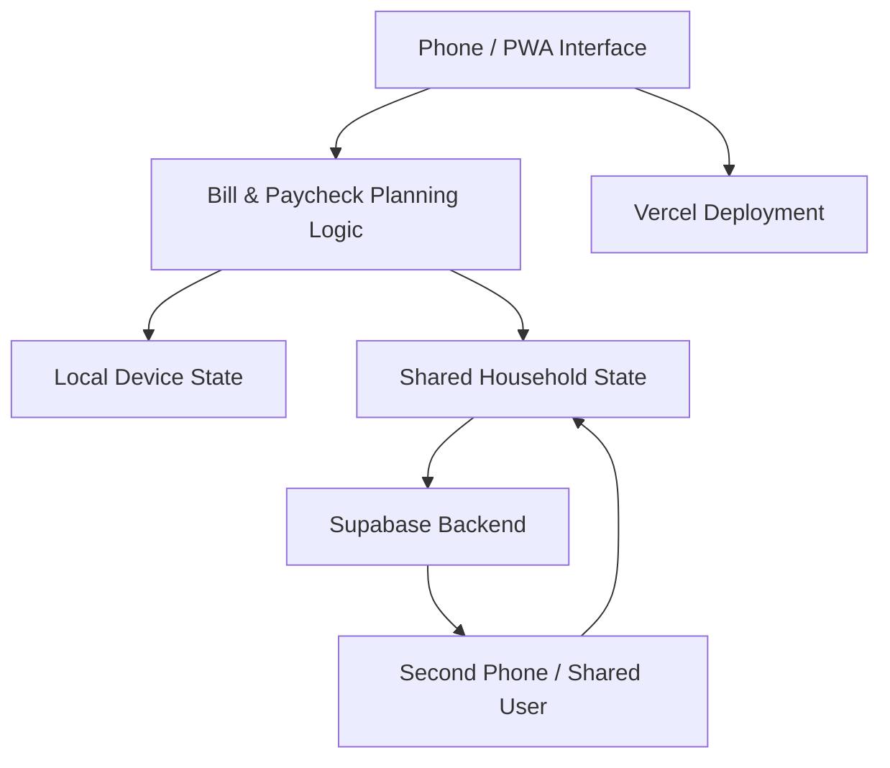

# Monthly Bill Calendar

[← Back to Profile](../README.md) • [Work Projects](../WORK_PROJECTS.md)

> **Status:** Active / production-use project  
> **Type:** Mobile-first Progressive Web App  
> **Focus:** Paycheck-based household cash-flow planning

A mobile-first budgeting application built around **paychecks**, not just due dates.

## The Problem

Most bill calendars tell you *when* something is due. That still leaves the user deciding which paycheck should cover each bill, how much will be left afterward, how two people with different pay schedules should coordinate, and what happens when a month contains an extra paycheck.

## The Solution

Monthly Bill Calendar turns that planning into a repeatable system. Each person can have an independent paycheck schedule, bill list, payment rules, editable check amounts, and preferences while sharing synchronized household data.

The central idea is simple: **plan obligations around when money arrives**.

## User Workflow

## Key Features

- Multi-person household support
- Independent bills and settings per person
- Recurring paycheck schedules
- Bill assignment by closest check or defined pay-cycle logic
- Support for alternating/opposite-week household pay schedules
- Editable paycheck amounts
- Payment-plan support across multiple checks
- Enable/disable controls for individual bills
- Future paycheck planning
- Support for three-paycheck months
- Recent paycheck history
- Shared synchronization between phones
- Installable Progressive Web App experience on Android and iPhone
- Mobile-first interface designed for quick weekly use
- Backup and restore workflow
- Shared household pairing without requiring separate editing accounts for every device

## Application Architecture

## Cash-Flow Logic

The interesting part of this project is not simply storing bills. The application has to reason about **cash-flow timing**:

- Which paycheck should fund a bill?
- Should an obligation use the closest available check or a defined pay-cycle rule?
- What happens when payroll dates move across month boundaries?
- How should the application handle months with an extra check?
- How are future checks generated without losing prior history?
- How should temporary bill changes or payment plans affect only the intended checks?

The scheduling logic is designed to make those decisions predictable rather than requiring the user to rebuild a monthly plan by hand.

## Shared Household Design

The application supports multiple phones working from the same household plan. Shared state is synchronized while device-specific UI state remains local where appropriate.

That distinction prevents one person's navigation or currently selected paycheck from unnecessarily changing the other person's screen while still keeping bill and payroll data synchronized.

## Reliability & UX Decisions

- Keep each person's bills and settings separate
- Make paycheck amounts editable without rewriting the base schedule
- Allow bills to be temporarily disabled rather than forcing deletion
- Keep payment-plan logic visible to the user
- Preserve recent history while continuing to generate future checks
- Maintain local usability when cloud synchronization is temporarily unavailable
- Use clear sync-state feedback so the user knows whether changes are local, syncing, or synchronized

## Technology

`Progressive Web App` • `JavaScript` • `Supabase` • `Vercel` • `Mobile-first UI` • `Shared State Synchronization`

## What This Demonstrates

Consumer application design, cash-flow scheduling logic, multi-user synchronization, state management, PWA deployment, mobile UX, recurring-date logic, backup/restore design, and turning a real household workflow into reusable software.

> Public portfolio documentation intentionally excludes private financial data, household access codes, account information, credentials, and production configuration.

[← Back to Profile](../README.md)