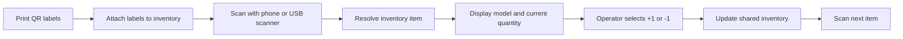
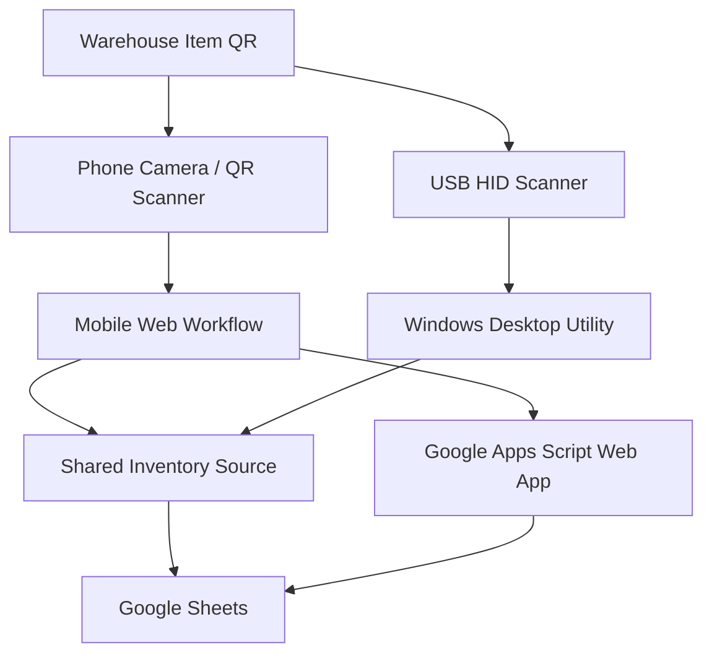

# QR Inventory Manager

[← Back to Profile](../README.md) • [Work Projects](../WORK_PROJECTS.md)

> **Status:** Functional warehouse workflow  
> **Type:** Mobile + Windows inventory tool  
> **Focus:** Fast scan-and-adjust inventory maintenance

A warehouse-focused inventory system designed for fast quantity updates with phones and USB scanners.

## The Problem

Traditional inventory software can be too heavy for a simple warehouse workflow where the main need is to identify an item and adjust its current quantity quickly.

The operator should not have to navigate a large POS or ERP interface just to scan an item, confirm the model, and change the on-hand quantity by one.

## The Solution

The QR Inventory Manager uses printable QR labels and a shared inventory source so an employee can scan an item, review its current quantity, make a simple `+1` or `-1` adjustment, and immediately move to the next item.

## Warehouse Workflow

## Key Features

- QR-code labels for inventory items
- Phone-based scanning workflow
- Zebra USB scanner support through keyboard/HID mode
- Simple `+1` and `-1` quantity controls
- Shared inventory updates through Google Sheets
- Windows desktop utility support
- Phone-first workflow for warehouse use
- Dedicated scan-next-item workflow
- Label layout designed with practical printing spacing
- Filtering to exclude retired or invalid inventory rows
- Simplified inventory model focused on item identity and current quantity
- No unnecessary POS or checkout functionality

## Architecture

## Data Model

The final workflow intentionally keeps the inventory schema minimal. The important operator-facing fields are:

- **Model** — the identifier shown to the operator
- **Current Quantity** — the value changed by scanning actions

Rows marked as inactive/retired are excluded from the operational workflow instead of appearing as valid scan targets.

## Engineering Focus

The main design goal is **speed and simplicity**. The tool avoids POS-style complexity and focuses only on the warehouse actions that matter:

1. Identify the item.
2. Show the current quantity.
3. Adjust it.
4. Move to the next scan.

Supporting both mobile cameras and keyboard/HID scanners required designing the inventory action itself independently from the scanning device.

## Integration

- Google Sheets as a shared inventory data source
- Google Apps Script web workflow for mobile access
- Windows desktop utility for keyboard/HID scanners
- Zebra DS22-series scanner compatibility through HID/keyboard mode
- QR-code generation and print layout

## Reliability & UX Decisions

- Restrict quantity changes to explicit `+1` and `-1` actions
- Keep the scanned model visible before the operator changes quantity
- Exclude inactive rows from QR generation and normal scanning
- Use one shared data source so phone and desktop workflows see the same quantity
- Design labels with enough physical spacing for reliable printing and cutting
- Optimize for repeated scan-adjust-scan cycles rather than long form entry

## What This Demonstrates

Warehouse workflow design, QR-code systems, scanner hardware integration, desktop/mobile interoperability, shared-data synchronization, Google Apps Script integration, and simplifying a larger inventory problem into the smallest useful operational interface.

> Public documentation omits production sheet identifiers, access configuration, deployment URLs, and private inventory data.

[← Back to Profile](../README.md)