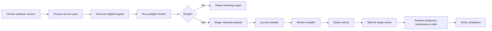
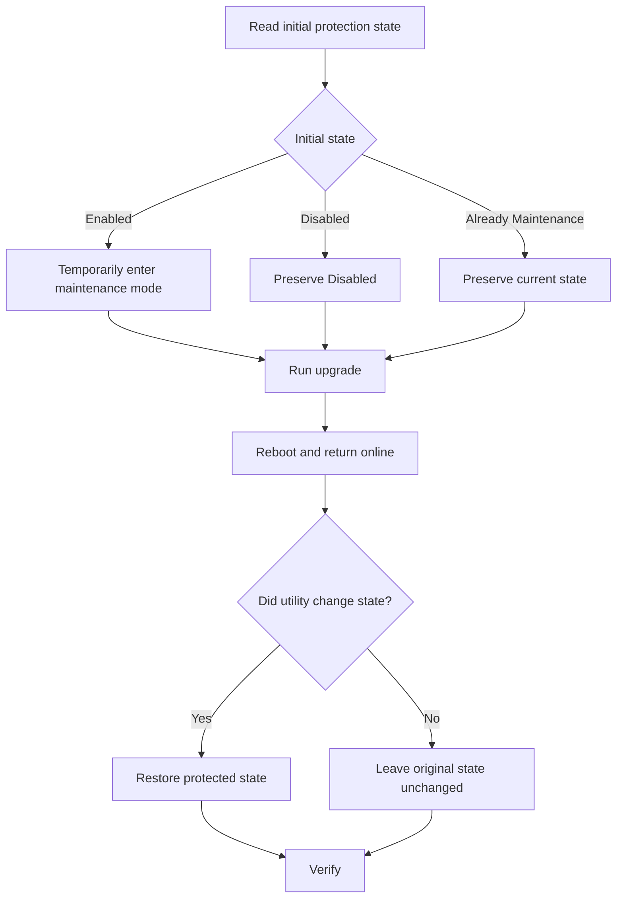

# Service Pack Upgrade Utility

[← Back to Profile](../README.md) • [Work Projects](../WORK_PROJECTS.md)

> **Status:** Proven multi-version deployment utility  
> **Type:** Windows fleet-upgrade orchestration  
> **Focus:** Safe multi-target deployment through reboot and recovery

A centralized deployment utility for coordinating software service-pack upgrades across POS systems and infrastructure servers while tracking preparation, installation, reboot, recovery, and protection-state restoration.

## The Problem

Service-pack rollouts across mixed device types can require different payloads, different eligibility checks, different launch methods, and different post-install behavior. Manually coordinating those steps across many systems increases the chance of skipping a prerequisite, losing track of a reboot, or leaving a system in the wrong protection state.

## The Solution

The Service Pack Upgrade Utility provides a single technician workflow for selecting a software version and service pack, discovering eligible targets, performing preflight checks, staging the correct payload, launching the upgrade, and monitoring each target through completion.

## End-to-End Workflow



## Core Capabilities

- Separate discovery of POS systems and server systems
- Version and service-pack selection
- Payload management for multiple supported upgrade packages
- Target filtering and reachability checks
- Silent preflight validation before deployment
- Per-target upgrade-stage tracking
- Visible installer launch where operator visibility is required
- Reboot detection and return-online monitoring
- Automatic completion checks
- Protection-state awareness and restoration for POS systems
- Multi-target progress reporting
- Support for retaining upgrade payloads for follow-up or audit workflows
- Package manager for adding and maintaining supported service-pack payloads

## Upgrade State Model

A target progresses through clear operational stages:

```text
STARTING
   ↓
INSTALLER STARTED
   ↓
INSTALLER RUNNING
   ↓
WAITING FOR REBOOT
   ↓
REBOOTING
   ↓
BACK ONLINE
   ↓
COMPLETE
```

This is intentionally more descriptive than a single progress bar. A technician can see whether a target is still installing, waiting for restart, offline during reboot, or fully recovered.

## Protection-State Handling



The key rule is ownership: the utility restores only the states that **it** changed.

## Engineering Focus

This project combines deployment orchestration, remote execution, state persistence, reboot monitoring, device-type-specific behavior, package selection, and rollback-minded preparation.

The difficult part is not merely starting an installer. The application must determine:

- whether the target is eligible,
- whether preflight preparation succeeded,
- whether the installer actually launched,
- whether installation is still running,
- whether the target rebooted,
- whether it came back online,
- and whether temporary system changes were restored correctly.

## Reliability & Guardrails

- Validate targets before copying upgrade files
- Block deployment when required preparation cannot be completed
- Keep per-target state rather than assuming the fleet is uniform
- Monitor through reboot instead of marking complete when the installer launches
- Restore only states the utility itself changed
- Preserve systems intentionally disabled or already in maintenance mode
- Keep server and POS payload selection distinct
- Surface blocking targets before the deployment begins

## What This Demonstrates

Fleet deployment automation, remote process management, state machines, Windows administration, reboot-aware orchestration, multi-version package management, safety checks, recovery logic, and operational UI design.

## Technology

`Python` • `Windows GUI` • `Remote Administration` • `Process Monitoring` • `Package Management` • `State Machines` • `Executable Packaging`

> Public documentation intentionally omits company-specific payloads, internal system names, credentials, network topology, protection passwords, and proprietary upgrade commands.

[← Back to Work Projects](../WORK_PROJECTS.md)